# YouTube Subtitle Downloader (ydl-rs) - Architecture Specification

**Document Version:** 1.0
**Date:** August 15, 2025
**Project:** ydl-rs
**Author:** Architecture Team

---

## 1. Executive Summary

The YouTube Subtitle Downloader (ydl-rs) is a Rust-based command-line application designed to efficiently download and process subtitles from YouTube videos. The application provides a simple interface for users to extract subtitle content in various formats by providing YouTube video URLs.

**Key Features:**
- Download subtitles from YouTube videos via URL input
- Support for multiple subtitle formats (SRT, VTT, TXT)
- Multiple language support with automatic detection
- Batch processing capabilities
- High-performance async processing with minimal resource footprint
- Extensible architecture for future enhancements

**Success Criteria:**
- Download speed: <3 seconds for standard videos
- Memory usage: <50MB peak for single video processing
- Error rate: <1% for valid YouTube URLs
- Subtitle accuracy: 100% preservation of original content

---

## 2. System Overview and Objectives

### 2.1 Primary Objectives

1. **Reliability**: Robust subtitle extraction with comprehensive error handling
2. **Performance**: Fast, efficient processing with minimal resource consumption
3. **Usability**: Simple, intuitive command-line interface
4. **Extensibility**: Modular architecture supporting future enhancements
5. **Security**: Safe handling of external content and URLs

### 2.2 Functional Requirements

- Accept YouTube video URLs as input
- Extract available subtitle tracks
- Support multiple output formats (SRT, VTT, TXT)
- Handle multiple languages and auto-generated subtitles
- Provide batch processing for multiple URLs
- Generate meaningful error messages and logging

### 2.3 Non-Functional Requirements

- **Performance**: Process single video subtitles within 3 seconds
- **Scalability**: Handle batch processing of up to 100 videos
- **Reliability**: 99.5% success rate for valid URLs
- **Security**: No execution of external code, safe URL validation
- **Maintainability**: Modular design with clear separation of concerns

---

## 3. High-Level Architecture

### 3.1 System Architecture Overview

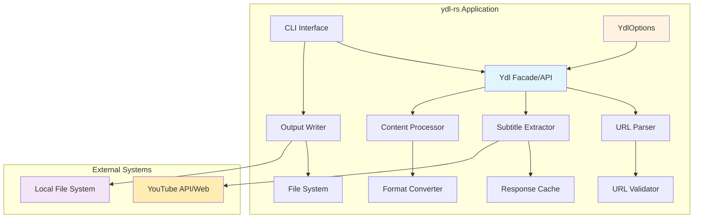

### 3.2 Component Interaction Flow

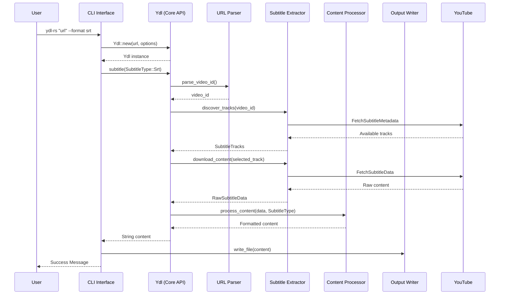

---

## 4. Core Components and Responsibilities

### 4.1 CLI Interface (`cli` module)

**Responsibilities:**
- Command-line argument parsing and validation
- User input processing and error messaging
- Output formatting and progress reporting
- Configuration management

**Key Functions:**
- `parse_args()` - Process command-line arguments
- `validate_inputs()` - Validate user inputs
- `display_progress()` - Show processing status
- `handle_errors()` - Format and display errors

### 4.2 Core Engine (`core` module)

The core engine is implemented through the `Ydl` struct, which serves as the main facade for all subtitle operations.

**Responsibilities:**
- Orchestrate the subtitle download process through `Ydl::subtitle()`
- Coordinate between internal components (parser, extractor, processor)
- Manage application state and configuration via `YdlOptions`
- Handle cross-cutting concerns (logging, metrics, error handling)

**Key Functions:**
- `Ydl::new()` - Initialize downloader with URL and options
- `Ydl::subtitle()` - Main subtitle download pipeline
- `Ydl::available_subtitles()` - Discover available tracks
- `Ydl::subtitles()` - Batch processing multiple formats
- `Ydl::metadata()` - Video metadata extraction

**Internal Architecture:**
```rust
impl Ydl {
    // Primary workflow coordination
    pub fn subtitle(&self, subtitle_type: SubtitleType) -> Result<String, YdlError> {
        let video_id = self.parse_video_id()?;          // URL Parser
        let tracks = self.discover_tracks(&video_id)?;   // Subtitle Extractor
        let selected = self.select_track(tracks)?;       // Track Selection
        let content = self.download_content(selected)?;  // Content Retrieval
        let formatted = self.process_content(content, subtitle_type)?; // Processor
        Ok(formatted)
    }
}
```

### 4.3 URL Parser (`parser` module)

**Responsibilities:**
- YouTube URL validation and normalization
- Video ID extraction from multiple URL formats
- URL format detection and conversion
- Security validation and domain verification

**Supported URL Formats:**
- `https://www.youtube.com/watch?v=VIDEO_ID`
- `https://youtube.com/watch?v=VIDEO_ID`
- `https://youtu.be/VIDEO_ID`
- `https://m.youtube.com/watch?v=VIDEO_ID`
- `https://www.youtube.com/embed/VIDEO_ID`
- URLs with additional parameters (timestamps, playlists)

**Key Functions:**
- `parse_youtube_url()` - Extract video information from various URL formats
- `validate_url()` - Security and format validation with domain allowlist
- `normalize_url()` - Convert to canonical form
- `extract_video_id()` - Extract 11-character video ID using regex patterns
- `handle_url_variations()` - Process different YouTube URL structures
- `validate_video_id()` - Ensure video ID matches YouTube's format requirements

### 4.4 API Client (`extractor` module)

**Responsibilities:**
- Interface with YouTube's internal subtitle mechanisms (no API keys required)
- Discover available subtitle tracks through metadata endpoints
- Handle rate limiting and request throttling
- Manage HTTP requests with proper headers and user agents
- Cache subtitle data and metadata for efficiency

**Subtitle Discovery Process:**
- Extract video metadata from YouTube's player configuration
- Parse subtitle track information from video page HTML
- Identify auto-generated vs manually created subtitles
- Handle language detection and track selection
- Process subtitle URLs and authentication tokens

**Key Functions:**
- `fetch_video_metadata()` - Extract video information and subtitle availability
- `discover_subtitle_tracks()` - Find all available subtitle languages and types
- `download_subtitle_content()` - Retrieve actual subtitle files
- `parse_track_list()` - Process available subtitle track metadata
- `handle_auto_generated()` - Specifically handle auto-generated subtitle tracks
- `extract_subtitle_urls()` - Get direct URLs for subtitle content
- `manage_request_headers()` - Set appropriate headers to avoid detection
- `handle_rate_limiting()` - Implement exponential backoff and retry logic
- `cache_responses()` - Cache metadata and content for performance

### 4.5 Content Processor (`processor` module)

**Responsibilities:**
- Parse and validate subtitle content
- Convert between subtitle formats
- Clean and normalize subtitle text
- Handle encoding issues

**Key Functions:**
- `parse_subtitle_format()` - Parse various subtitle formats
- `convert_format()` - Convert between formats (SRT, VTT, TXT)
- `clean_content()` - Remove unwanted characters/formatting
- `validate_timestamps()` - Ensure timing accuracy

### 4.6 Output Writer (`writer` module)

**Responsibilities:**
- File system operations
- Output path management
- File naming conventions
- Atomic write operations

**Key Functions:**
- `write_subtitle_file()` - Save subtitles to disk
- `generate_filename()` - Create appropriate filenames
- `ensure_directory()` - Create output directories
- `atomic_write()` - Safe file operations

---

## 5. YouTube Integration Strategy

### 5.1 Video Metadata Extraction

**Without API Keys Strategy:**
The application uses YouTube's public web interface to extract video metadata and subtitle information without requiring official API access.

**Metadata Sources:**
1. **Video Page HTML**: Parse the initial page HTML for embedded player configuration
2. **Player Config JSON**: Extract subtitle track URLs from YouTube's player response
3. **Watch Page Data**: Get video metadata from client-side JavaScript objects
4. **Mobile Endpoints**: Use mobile-specific endpoints for lighter responses

### 5.2 Subtitle Discovery Mechanism

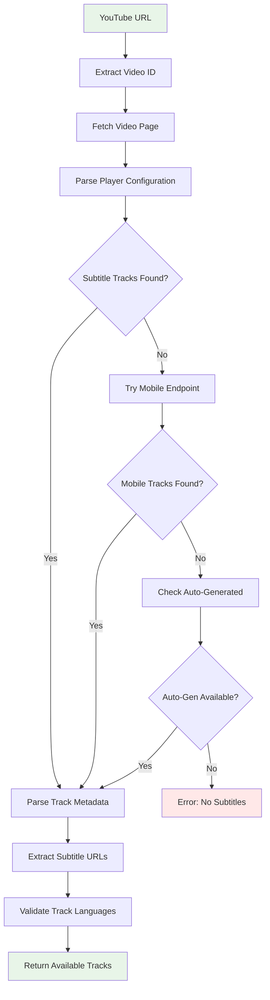

### 5.3 Subtitle Retrieval Techniques

**Primary Method: Player Configuration Parsing**
```rust
// Extract subtitle tracks from player response
struct PlayerResponse {
    captions: Option<CaptionTracks>,
}

struct CaptionTracks {
    player_captions_tracklist_renderer: Option<TrackListRenderer>,
}

struct TrackListRenderer {
    caption_tracks: Vec<CaptionTrack>,
    audio_tracks: Vec<AudioTrack>,
}
```

**Fallback Methods:**
1. **Mobile API Endpoint**: Use mobile-specific YouTube endpoints for simpler responses
2. **Direct URL Construction**: Build subtitle URLs based on video ID patterns
3. **Transcript Endpoint**: Access YouTube's transcript API endpoints
4. **Auto-Generated Discovery**: Find auto-generated subtitles when manual ones aren't available

**Subtitle Types Handled:**
- **Manual Subtitles**: Creator-uploaded subtitle files
- **Auto-Generated**: YouTube's automatically generated subtitles
- **Community Contributions**: User-contributed subtitle tracks
- **Multi-Language**: Support for multiple language tracks per video

### 5.4 Authentication and Rate Limiting

**No Authentication Required:**
- All subtitle access uses publicly available endpoints
- No API keys, OAuth, or user authentication needed
- Mimics standard web browser behavior

**Rate Limiting Strategy:**
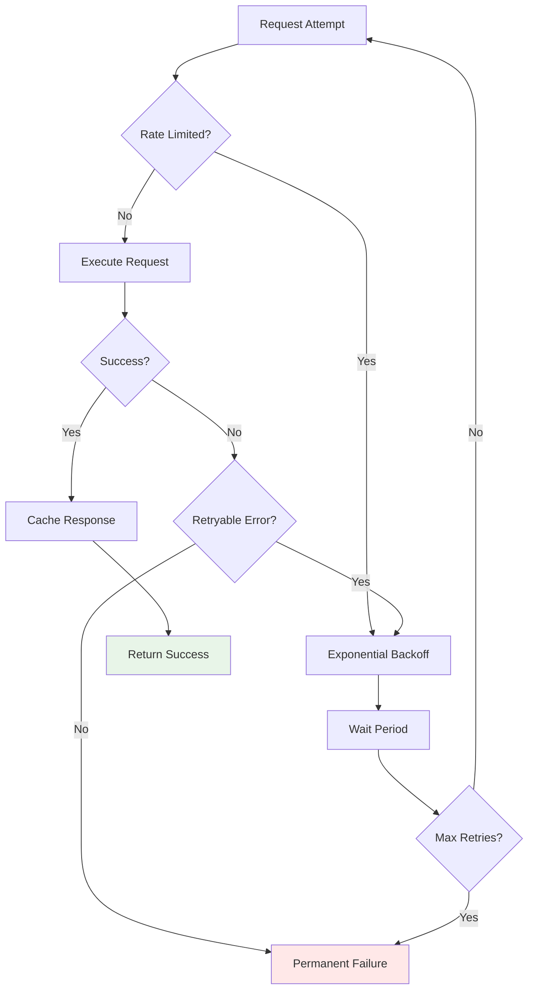

**Anti-Detection Measures:**
- Rotate User-Agent strings to simulate different browsers
- Implement realistic request timing and patterns
- Use appropriate HTTP headers and referrers
- Respect robots.txt and rate limiting signals
- Cache aggressively to minimize requests

### 5.5 YouTube-Specific Error Handling

**Common YouTube Issues:**
- **Video Not Found (404)**: Invalid video ID or deleted video
- **Private/Restricted Video**: Access denied due to privacy settings
- **Geo-blocked Content**: Content not available in certain regions
- **Age-Restricted Content**: Requires age verification
- **No Subtitles Available**: Video has no subtitle tracks
- **Auto-Generated Only**: Only auto-generated subtitles available
- **Rate Limiting (429)**: Too many requests in short time period
- **Temporary Unavailability (503)**: YouTube service temporarily down

**Error Recovery Strategies:**

```rust
#[derive(thiserror::Error, Debug)]
pub enum YouTubeError {
    #[error("Video not found: {video_id}")]
    VideoNotFound { video_id: String },

    #[error("Video is private or restricted: {video_id}")]
    VideoRestricted { video_id: String },

    #[error("No subtitles available for video: {video_id}")]
    NoSubtitlesAvailable { video_id: String },

    #[error("Only auto-generated subtitles available for video: {video_id}")]
    OnlyAutoGenerated { video_id: String },

    #[error("Content geo-blocked in this region: {video_id}")]
    GeoBlocked { video_id: String },

    #[error("Age-restricted content requires verification: {video_id}")]
    AgeRestricted { video_id: String },

    #[error("Rate limited by YouTube, retry after {seconds}s")]
    RateLimited { seconds: u64 },

    #[error("YouTube service temporarily unavailable")]
    ServiceUnavailable,
}
```

---

## 6. Data Flow and Processing Pipeline

### 6.1 Enhanced Data Flow with YouTube Integration

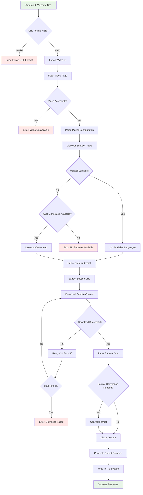

### 6.2 Subtitle Discovery Process Flow

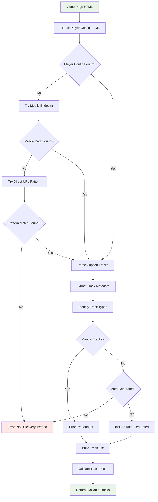

### 6.3 Error Handling Flow

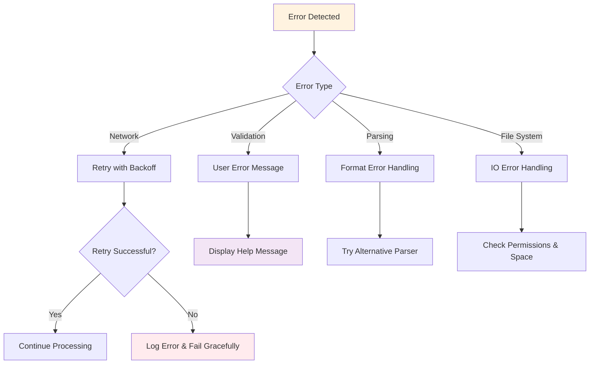

---

## 6. API/Interface Design

### 6.1 Core Library API

The primary API follows a simple and elegant pattern with `Ydl` as the main orchestrator:

```rust
// Primary API usage pattern
let downloader = Ydl::new(url, options);
let content = downloader.subtitle(SubtitleType::Srt);
// store or consume the content
```

#### Main API Structure

```rust
/// Main orchestrator for subtitle downloads
pub struct Ydl {
    url: String,
    options: YdlOptions,
    // Internal components accessed through this facade
}

impl Ydl {
    /// Create a new downloader instance for a specific URL
    pub fn new(url: &str, options: YdlOptions) -> Result<Self, YdlError> {
        // URL validation and initialization
    }

    /// Download subtitles in the specified format
    pub fn subtitle(&self, subtitle_type: SubtitleType) -> Result<String, YdlError> {
        // Main subtitle download method
    }

    /// Download subtitles in the specified format (async variant)
    pub async fn subtitle_async(&self, subtitle_type: SubtitleType) -> Result<String, YdlError> {
        // Async version for non-blocking operations
    }

    /// List all available subtitle tracks for the video
    pub fn available_subtitles(&self) -> Result<Vec<SubtitleTrack>, YdlError> {
        // Discover available subtitle options
    }

    /// Download multiple subtitle formats at once
    pub fn subtitles(&self, types: &[SubtitleType]) -> Result<Vec<SubtitleResult>, YdlError> {
        // Batch download multiple formats
    }

    /// Get video metadata without downloading subtitles
    pub fn metadata(&self) -> Result<VideoMetadata, YdlError> {
        // Video information and available tracks
    }
}
```

#### Subtitle Type Enumeration

```rust
/// Available subtitle formats
#[derive(Debug, Clone, Copy, PartialEq, Eq)]
pub enum SubtitleType {
    /// SubRip Subtitle format (.srt)
    Srt,
    /// WebVTT format (.vtt)
    Vtt,
    /// Plain text format (.txt)
    Txt,
    /// JSON format with timing data
    Json,
    /// Raw format as received from source
    Raw,
}

impl SubtitleType {
    /// Get file extension for the format
    pub fn extension(&self) -> &'static str {
        match self {
            SubtitleType::Srt => "srt",
            SubtitleType::Vtt => "vtt",
            SubtitleType::Txt => "txt",
            SubtitleType::Json => "json",
            SubtitleType::Raw => "xml",
        }
    }

    /// Get MIME type for the format
    pub fn mime_type(&self) -> &'static str {
        match self {
            SubtitleType::Srt => "application/x-subrip",
            SubtitleType::Vtt => "text/vtt",
            SubtitleType::Txt => "text/plain",
            SubtitleType::Json => "application/json",
            SubtitleType::Raw => "application/xml",
        }
    }
}
```

#### Options Configuration

```rust
/// Configuration options for subtitle downloads
#[derive(Debug, Clone)]
pub struct YdlOptions {
    /// Preferred language code (e.g., "en", "es", "auto")
    pub language: Option<String>,

    /// Whether to allow auto-generated subtitles
    pub allow_auto_generated: bool,

    /// Whether to prefer manual over auto-generated subtitles
    pub prefer_manual: bool,

    /// Maximum retry attempts for failed requests
    pub max_retries: u32,

    /// Request timeout in seconds
    pub timeout_seconds: u64,

    /// Custom User-Agent string
    pub user_agent: Option<String>,

    /// Proxy settings
    pub proxy: Option<String>,

    /// Whether to clean/normalize subtitle content
    pub clean_content: bool,

    /// Whether to validate subtitle timing
    pub validate_timing: bool,
}

impl Default for YdlOptions {
    fn default() -> Self {
        Self {
            language: None, // Auto-detect
            allow_auto_generated: true,
            prefer_manual: true,
            max_retries: 3,
            timeout_seconds: 30,
            user_agent: None, // Use default
            proxy: None,
            clean_content: true,
            validate_timing: true,
        }
    }
}

impl YdlOptions {
    /// Create options with default values
    pub fn new() -> Self {
        Self::default()
    }

    /// Builder pattern for fluent configuration
    pub fn language(mut self, lang: &str) -> Self {
        self.language = Some(lang.to_string());
        self
    }

    pub fn allow_auto_generated(mut self, allow: bool) -> Self {
        self.allow_auto_generated = allow;
        self
    }

    pub fn timeout(mut self, seconds: u64) -> Self {
        self.timeout_seconds = seconds;
        self
    }

    pub fn user_agent(mut self, ua: &str) -> Self {
        self.user_agent = Some(ua.to_string());
        self
    }

    pub fn proxy(mut self, proxy_url: &str) -> Self {
        self.proxy = Some(proxy_url.to_string());
        self
    }
}
```

### 6.2 Public API Reference

#### Basic Usage Examples

```rust
use ydl_rs::{Ydl, YdlOptions, SubtitleType};

// Basic usage with default options
let downloader = Ydl::new("https://youtube.com/watch?v=VIDEO_ID", YdlOptions::default())?;
let srt_content = downloader.subtitle(SubtitleType::Srt)?;
println!("Downloaded subtitle:\n{}", srt_content);

// With custom options using builder pattern
let options = YdlOptions::new()
    .language("en")
    .allow_auto_generated(false)
    .timeout(60);

let downloader = Ydl::new("https://youtu.be/VIDEO_ID", options)?;
let vtt_content = downloader.subtitle(SubtitleType::Vtt)?;

// Multiple formats at once
let formats = [SubtitleType::Srt, SubtitleType::Vtt, SubtitleType::Txt];
let results = downloader.subtitles(&formats)?;
for result in results {
    println!("Format: {:?}, Content length: {}", result.format, result.content.len());
}

// Async usage
let content = downloader.subtitle_async(SubtitleType::Srt).await?;
```

#### Advanced Usage Examples

```rust
// Check available subtitles before downloading
let downloader = Ydl::new(url, YdlOptions::default())?;
let available = downloader.available_subtitles()?;

for track in available {
    println!("Language: {} ({}), Type: {:?}",
             track.language_name, track.language_code, track.track_type);
}

// Download with specific language preference
let options = YdlOptions::new().language("es");
let downloader = Ydl::new(url, options)?;
let spanish_srt = downloader.subtitle(SubtitleType::Srt)?;

// Error handling pattern
match downloader.subtitle(SubtitleType::Srt) {
    Ok(content) => {
        // Process subtitle content
        std::fs::write("subtitle.srt", content)?;
        println!("Subtitle saved successfully");
    }
    Err(YdlError::NoSubtitlesAvailable { video_id }) => {
        println!("No subtitles available for video: {}", video_id);
    }
    Err(YdlError::VideoNotFound { video_id }) => {
        println!("Video not found: {}", video_id);
    }
    Err(e) => {
        eprintln!("Download failed: {}", e);
    }
}
```

#### Return Types and Error Handling

```rust
/// Result of a subtitle download operation
#[derive(Debug, Clone)]
pub struct SubtitleResult {
    pub content: String,
    pub format: SubtitleType,
    pub language: String,
    pub track_type: SubtitleTrackType,
}

/// Information about available subtitle tracks
#[derive(Debug, Clone)]
pub struct SubtitleTrack {
    pub language_code: String,
    pub language_name: String,
    pub track_type: SubtitleTrackType,
    pub is_translatable: bool,
}

/// Video metadata information
#[derive(Debug, Clone)]
pub struct VideoMetadata {
    pub video_id: String,
    pub title: String,
    pub duration: Option<std::time::Duration>,
    pub available_subtitles: Vec<SubtitleTrack>,
}

/// Types of subtitle tracks
#[derive(Debug, Clone, PartialEq, Eq)]
pub enum SubtitleTrackType {
    /// Manually created subtitles
    Manual,
    /// Auto-generated by YouTube
    AutoGenerated,
    /// Community contributed
    Community,
}
```

### 6.3 Component Architecture Alignment

The `Ydl` struct serves as the main facade that coordinates internal components:

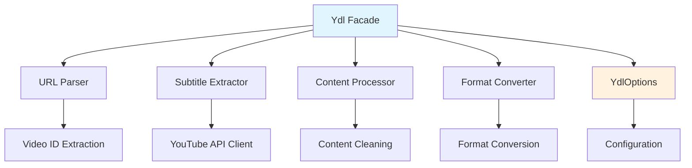

### 6.4 Method Chaining and Fluent Interface

```rust
// Future extension possibilities for method chaining
impl Ydl {
    /// Chain operations for fluent interface (future extension)
    pub fn with_language(mut self, lang: &str) -> Self {
        // Update language preference
        self
    }

    pub fn with_format_preference(mut self, formats: &[SubtitleType]) -> Self {
        // Set format preference order
        self
    }
}

// Usage example:
let content = Ydl::new(url, options)?
    .with_language("en")
    .subtitle(SubtitleType::Srt)?;
```

### 6.5 Command-Line Interface

The CLI wraps the core API for command-line usage:

```bash
# Basic usage - leverages Ydl::new() and subtitle() internally
ydl-rs "https://youtube.com/watch?v=VIDEO_ID"

# Format specification
ydl-rs "https://youtube.com/watch?v=VIDEO_ID" --format srt

# Language selection
ydl-rs "https://youtube.com/watch?v=VIDEO_ID" --language en

# Multiple formats
ydl-rs "https://youtube.com/watch?v=VIDEO_ID" --format srt,vtt,txt

# List available subtitles (uses available_subtitles())
ydl-rs "https://youtube.com/watch?v=VIDEO_ID" --list

# Advanced options
ydl-rs "https://youtube.com/watch?v=VIDEO_ID" --format vtt --language auto --timeout 60
```

### 6.6 Configuration Options

| CLI Flag | YdlOptions Field | Description | Default |
|----------|------------------|-------------|---------|
| `--format` | N/A (method param) | Output format (srt,vtt,txt,json) | `srt` |
| `--language` | `language` | Subtitle language code | `auto` |
| `--timeout` | `timeout_seconds` | Request timeout (seconds) | `30` |
| `--retries` | `max_retries` | Max retry attempts | `3` |
| `--user-agent` | `user_agent` | Custom User-Agent string | Auto |
| `--proxy` | `proxy` | Proxy server URL | None |
| `--allow-auto` | `allow_auto_generated` | Allow auto-generated subtitles | `true` |
| `--prefer-manual` | `prefer_manual` | Prefer manual over auto-generated | `true` |
| `--clean` | `clean_content` | Clean subtitle formatting | `true` |
| `--validate-timing` | `validate_timing` | Validate subtitle timing | `true` |

---

## 7. Technology Stack and Dependencies

### 7.1 Core Dependencies

```toml
[dependencies]
# HTTP Client and Async Runtime
tokio = { version = "1.0", features = ["full"] }
reqwest = { version = "0.11", features = ["json", "stream"] }

# CLI and Configuration
clap = { version = "4.0", features = ["derive"] }
serde = { version = "1.0", features = ["derive"] }
serde_json = "1.0"

# URL Processing and Validation
url = "2.4"
regex = "1.9"

# File I/O and Encoding
encoding_rs = "0.8"
tempfile = "3.7"

# Error Handling and Logging
anyhow = "1.0"
thiserror = "1.0"
tracing = "0.1"
tracing-subscriber = "0.3"

# Testing
mockito = "1.1"
assert_cmd = "2.0"
```

### 7.2 Development Tools

```toml
[dev-dependencies]
criterion = "0.5"        # Benchmarking
proptest = "1.2"         # Property-based testing
wiremock = "0.5"         # HTTP mocking for tests

[build-dependencies]
built = "0.7"            # Build-time information
```

### 7.3 Technology Rationale

| Technology | Rationale |
|------------|-----------|
| **Rust** | Memory safety, performance, excellent async support |
| **Tokio** | Production-ready async runtime with great ecosystem |
| **Reqwest** | Feature-rich HTTP client with async support |
| **Clap** | Powerful CLI parsing with derive macros |
| **Tracing** | Structured logging with async awareness |
| **Serde** | De-facto standard for serialization in Rust |

---

## 8. Error Handling Strategy

### 8.1 Error Taxonomy

```rust
/// Main error type for the Ydl API
#[derive(thiserror::Error, Debug)]
pub enum YdlError {
    #[error("Invalid YouTube URL format: {url}")]
    InvalidUrl { url: String },

    #[error("Invalid video ID format: {video_id}")]
    InvalidVideoId { video_id: String },

    #[error("Network error: {source}")]
    Network { #[from] source: reqwest::Error },

    #[error("Video not found or unavailable: {video_id}")]
    VideoNotFound { video_id: String },

    #[error("Video is private or restricted: {video_id}")]
    VideoRestricted { video_id: String },

    #[error("Content is geo-blocked in this region: {video_id}")]
    GeoBlocked { video_id: String },

    #[error("Age-restricted content requires verification: {video_id}")]
    AgeRestricted { video_id: String },

    #[error("No subtitles available for video: {video_id}")]
    NoSubtitlesAvailable { video_id: String },

    #[error("Only auto-generated subtitles available for video: {video_id}")]
    OnlyAutoGenerated { video_id: String },

    #[error("Requested language not available: {language}")]
    LanguageNotAvailable { language: String },

    #[error("Unsupported subtitle format: {format:?}")]
    UnsupportedFormat { format: SubtitleType },

    #[error("Failed to parse video metadata: {message}")]
    MetadataParsingError { message: String },

    #[error("Failed to discover subtitle tracks: {message}")]
    SubtitleDiscoveryError { message: String },

    #[error("File system error: {source}")]
    FileSystem { #[from] source: std::io::Error },

    #[error("Subtitle parsing error: {message}")]
    SubtitleParsing { message: String },

    #[error("Format conversion error: from {from:?} to {to:?}")]
    FormatConversion { from: SubtitleType, to: SubtitleType },

    #[error("Rate limit exceeded, retry after {retry_after}s")]
    RateLimited { retry_after: u64 },

    #[error("Request timeout after {timeout}s")]
    Timeout { timeout: u64 },

    #[error("YouTube service temporarily unavailable")]
    ServiceUnavailable,

    #[error("Configuration error: {message}")]
    Configuration { message: String },
}

impl YdlError {
    /// Check if the error is retryable
    pub fn is_retryable(&self) -> bool {
        matches!(self,
            YdlError::Network { .. } |
            YdlError::RateLimited { .. } |
            YdlError::Timeout { .. } |
            YdlError::ServiceUnavailable
        )
    }

    /// Get suggested retry delay in seconds
    pub fn retry_delay(&self) -> Option<u64> {
        match self {
            YdlError::RateLimited { retry_after } => Some(*retry_after),
            YdlError::Network { .. } => Some(1),
            YdlError::ServiceUnavailable => Some(5),
            YdlError::Timeout { .. } => Some(2),
            _ => None,
        }
    }
}
```

### 8.2 Error Recovery Strategies

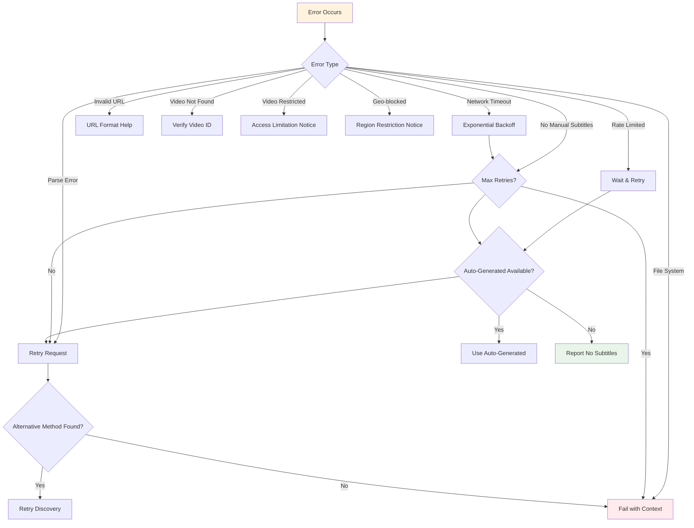

### 8.3 Resilience Patterns

1. **Circuit Breaker**: Prevent cascading failures for repeated network errors
2. **Retry with Backoff**: Exponential backoff for transient failures
3. **Graceful Degradation**: Fall back to auto-generated subtitles when manual ones fail
4. **Multiple Discovery Methods**: Try different subtitle discovery techniques
5. **Timeout Management**: Configurable timeouts with reasonable defaults
6. **Resource Cleanup**: Ensure proper cleanup on errors (temp files, connections)
7. **User Guidance**: Provide helpful error messages with suggested actions

---

## 9. Security Considerations

### 9.1 Input Validation

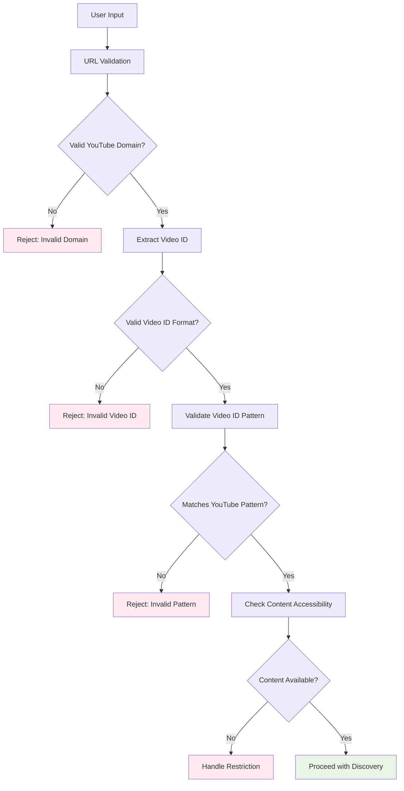

### 9.2 Security Measures

| Area | Measure | Implementation |
|------|---------|----------------|
| **URL Validation** | Format and domain validation | Regex patterns, YouTube domain allowlist |
| **Video ID Validation** | Pattern matching | 11-character alphanumeric validation |
| **Network Security** | HTTPS only | Enforce TLS, certificate validation |
| **Request Headers** | Browser simulation | Realistic User-Agent and headers |
| **File System** | Path traversal prevention | Canonicalize paths, validate output dirs |
| **Resource Limits** | DoS prevention | Request timeouts, concurrent limits |
| **Data Sanitization** | Content cleaning | Remove potentially harmful content |
| **Error Information** | Information disclosure | Generic error messages to users |
| **Rate Limiting** | Anti-abuse measures | Exponential backoff, request spacing |

### 9.3 Threat Model

**Threats Considered:**

1. **Malicious URLs**: Invalid, crafted, or non-YouTube URLs
2. **Video ID Manipulation**: Crafted video IDs to exploit parsing
3. **Path Traversal**: Attempts to write files outside intended directories
4. **DoS Attacks**: Resource exhaustion through excessive requests
5. **Rate Limit Evasion**: Attempts to bypass YouTube's rate limiting
6. **Man-in-the-Middle**: Network interception attempts
7. **Content Injection**: Malicious content in subtitle data
8. **Metadata Poisoning**: Crafted video metadata to exploit parsing

**Mitigations:**

- Strict YouTube URL format validation with domain allowlist
- Video ID format validation (11-character alphanumeric pattern)
- Output path restriction and validation
- Intelligent rate limiting with exponential backoff
- HTTPS enforcement with certificate validation
- Content sanitization and encoding validation
- Realistic browser simulation to avoid detection
- Comprehensive error handling without information disclosure

---

## 10. Performance Considerations

### 10.1 Performance Targets

| Metric | Target | Measurement |
|--------|--------|-------------|
| **Single Video** | <3 seconds | End-to-end processing time |
| **Memory Usage** | <50MB peak | RSS during single video |
| **Concurrent Downloads** | 5 simultaneous | Without degradation |
| **Batch Processing** | 100 videos in <5 minutes | Average throughput |
| **CPU Usage** | <25% on single core | During active processing |
| **Network Efficiency** | <2 requests per video | Minimize API calls |

### 10.2 Performance Architecture

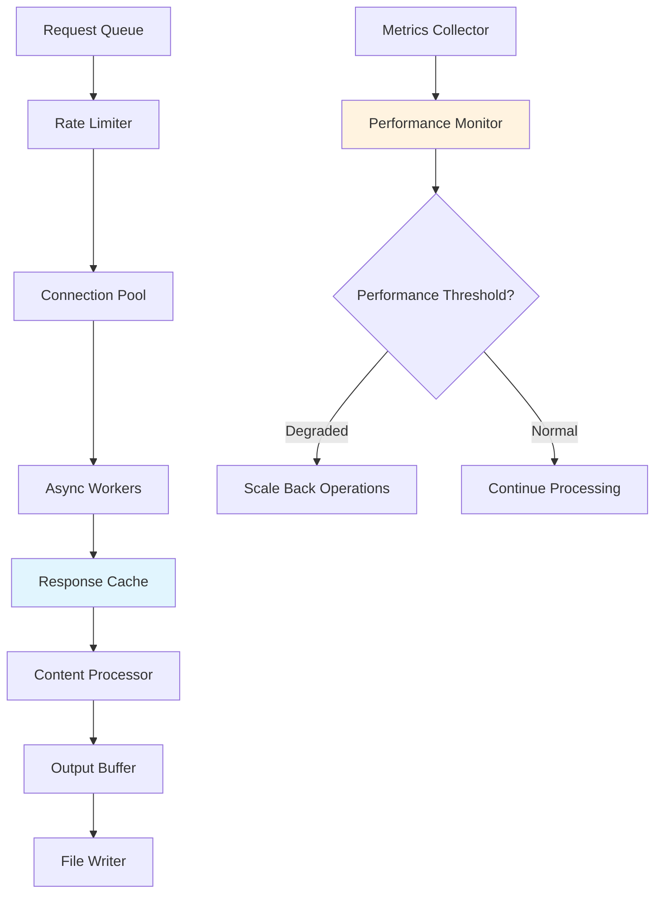

### 10.3 Optimization Strategies

1. **Async Processing**: Non-blocking I/O for network and file operations
2. **Connection Pooling**: Reuse HTTP connections for efficiency
3. **Response Caching**: Cache subtitle lists and metadata
4. **Streaming Processing**: Process large subtitle files as streams
5. **Parallel Downloads**: Concurrent processing with controlled limits
6. **Memory Management**: Zero-copy parsing where possible

### 10.4 Benchmarking and Monitoring

```rust
// Performance benchmarks
#[bench]
fn bench_single_video_download(b: &mut Bencher) {
    b.iter(|| {
        // Benchmark single video processing
    });
}

#[bench]
fn bench_batch_processing(b: &mut Bencher) {
    b.iter(|| {
        // Benchmark batch operations
    });
}

// Runtime metrics
struct PerformanceMetrics {
    download_duration: Histogram,
    memory_usage: Gauge,
    concurrent_requests: Gauge,
    error_rate: Counter,
}
```

---

## 11. Deployment Architecture

### 11.1 Distribution Strategy

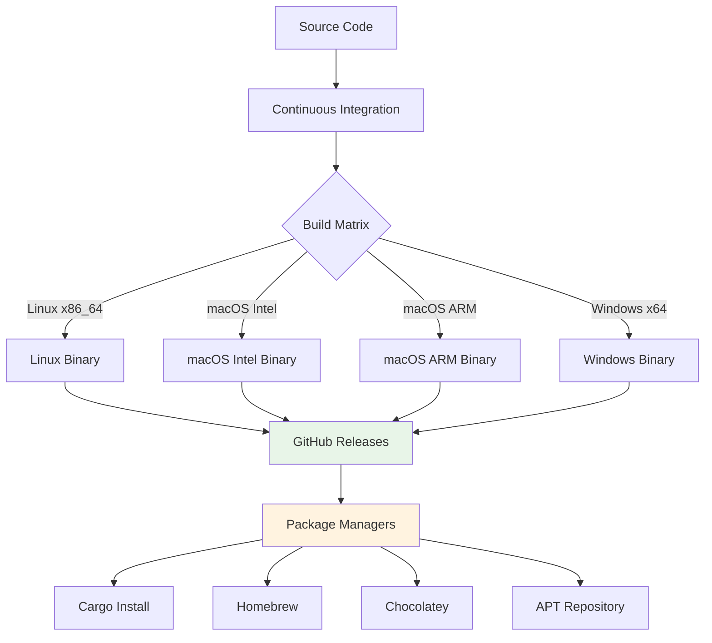

### 11.2 Installation Methods

| Method | Platform | Command |
|--------|----------|---------|
| **Cargo** | All | `cargo install ydl-rs` |
| **Homebrew** | macOS/Linux | `brew install ydl-rs` |
| **Chocolatey** | Windows | `choco install ydl-rs` |
| **APT** | Ubuntu/Debian | `apt install ydl-rs` |
| **Direct Download** | All | GitHub releases |
| **Container** | All | `docker run ydl-rs` |

### 11.3 Build and Release Pipeline

```yaml
# CI/CD Pipeline Overview
stages:
  - validate:
    - code_quality: clippy, fmt, audit
    - testing: unit, integration, property
    - security: dependency_scan, vulnerability_check

  - build:
    - compile: all_targets
    - optimize: release_profile
    - package: platform_specific

  - test:
    - functionality: end_to_end
    - performance: benchmarks
    - compatibility: platform_testing

  - release:
    - versioning: semantic_versioning
    - artifacts: signed_binaries
    - distribution: package_managers
```

### 11.4 Configuration Management

```toml
# ~/.config/ydl-rs/config.toml
[defaults]
format = "srt"
output_dir = "~/Downloads/subtitles"
concurrent_downloads = 3
timeout = 30

[network]
user_agent = "ydl-rs/1.0"
retry_attempts = 3
retry_delay = 1000

[output]
filename_template = "{title}_{language}.{format}"
create_directories = true
overwrite_existing = false
```

---

## 12. Future Extensibility and Roadmap

### 12.1 Extension Points

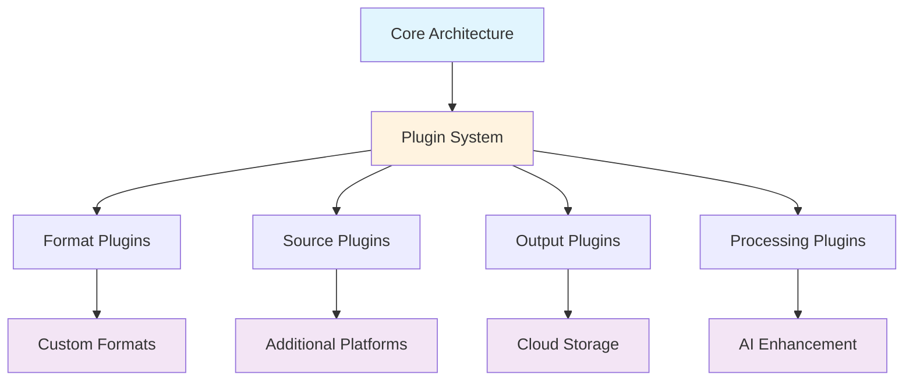

### 12.2 Planned Enhancements

#### Phase 1 (v1.1-1.3)

- **Multi-platform Support**: Vimeo, Dailymotion, other video platforms
- **Advanced Filtering**: Content filtering and customization options
- **GUI Application**: Cross-platform desktop interface
- **API Server Mode**: REST API for integration with other applications

#### Phase 2 (v1.4-1.6)

- **AI-Enhanced Subtitles**: Improve auto-generated subtitle quality
- **Translation Services**: Automatic translation between languages
- **Subtitle Synchronization**: Fix timing issues automatically
- **Advanced Output Formats**: Support for more specialized formats

#### Phase 3 (v2.0+)

- **Plugin Architecture**: Extensible plugin system for custom functionality
- **Cloud Integration**: Direct upload to cloud storage services
- **Batch Management**: Advanced batch processing with scheduling
- **Analytics Dashboard**: Usage statistics and performance monitoring

### 12.3 Architectural Considerations for Extensibility

1. **Modular Design**: Clear separation between core and optional features
2. **Trait-Based Interfaces**: Pluggable components through Rust traits
3. **Configuration System**: Flexible configuration for new features
4. **API Versioning**: Stable public APIs with semantic versioning
5. **Documentation**: Comprehensive docs for extension development

### 12.4 Migration Strategy

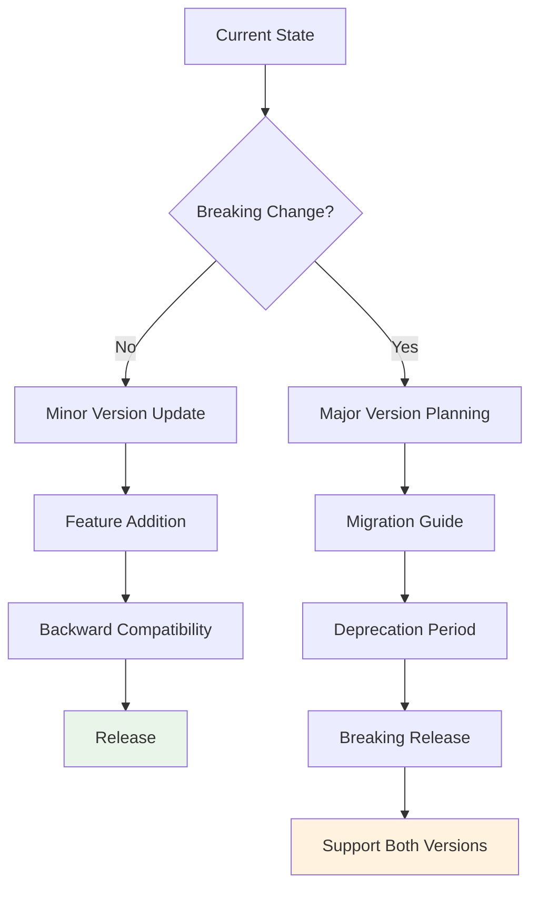

---

## Conclusion

This architecture specification provides a comprehensive foundation for the YouTube Subtitle Downloader (ydl-rs) project. The design emphasizes:

- **Modularity**: Clear separation of concerns with well-defined interfaces
- **Performance**: Async-first design with efficient resource utilization
- **Reliability**: Comprehensive error handling and recovery strategies
- **Security**: Multi-layered approach to input validation and system protection
- **Extensibility**: Plugin architecture and clear extension points for future growth

The architecture supports the immediate requirements while providing a solid foundation for future enhancements and scalability needs.

---

**Next Steps:**

1. Review and approve this specification
2. Set up development environment and CI/CD pipeline
3. Implement core components following the modular design
4. Establish testing framework and quality gates
5. Begin iterative development with regular architecture reviews
